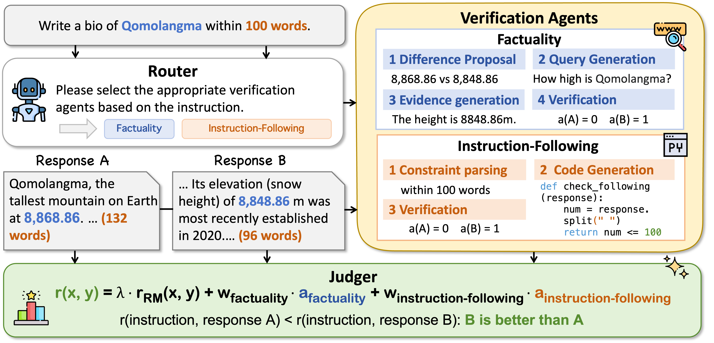
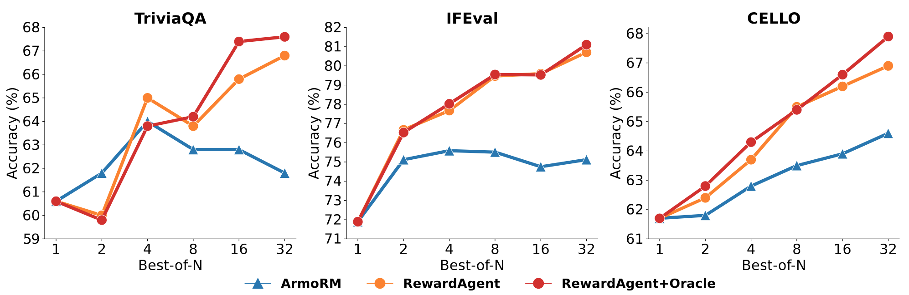

<p align="center">
    
</p>

---------
[Agentic reward modeling](https://arxiv.org/abs/2502.19328) is a reward system that combines reward models with **verifiable correctness signals** from different aspects to provide reliable rewards. 
We empirically implement a reward agent in this repo, named **RewardAgent**, that combines human preference rewards with two verifiable signals: **factuality** and **instruction following**, to provide more reliable rewards. The overall architecture of RewardAgent is as follows: 

<p align="center">
    
</p>
<!--  -->

RewardAgent demonstrates impressive results on reward model benchmarks, best-of-n search, and DPO training. The figure below presents the best-of-n search results, with Llama3-8B-Instruct as the policy model.
<p align="center">
    
</p>

For more details, please refer to our [paper](https://arxiv.org/abs/2502.19328).

----------

# 0. Setup
Before running any of the scripts, ensure you have the necessary environment set up. You can install the required dependencies using the requirements.txt file:
```bash
pip install -r requirements.txt
```
If you are using non-API-based LLMs, you need to deploy the LLM locally first. You can refer to the vllm_serve.sh script for deployment. Here is an example of how to deploy a local LLM:

**Deploy Llama3-8B-Instruct**
```bash
CUDA_VISIBLE_DEVICES=2 vllm serve <path> \
    --served-model-name llama-3-8b \
    --port 8001 \
    --tensor-parallel-size 1 \
    --max-model-len 8192 \
    --gpu-memory-utilization 0.9
```
**Deploy Qwen2.5-Coder 7B**
```bash
CUDA_VISIBLE_DEVICES=3 vllm serve <path> \
    --served-model-name qwen25-coder-7b \
    --port 8002 \
    --tensor-parallel-size 1 \
    --max-model-len 8192 \
    --gpu-memory-utilization 0.9
```
Replace `<path>` with the actual paths to your models.


<!-- # 1. Docker Environment Setup (Optionally)
To ensure a consistent and safe environment for running all scripts, it is recommended to use a Docker container. You can also choose not to use the Docker environment.
### Dockerfile
Create a Dockerfile in the root directory of your project:
```dockerfile
# Use an official Python runtime as a parent image
FROM python:3.9-slim

# Set the working directory in the container
WORKDIR /app

# Copy the current directory contents into the container at /app
COPY . /app

# Install any needed packages specified in requirements.txt
RUN pip install --no-cache-dir -r requirements.txt

# Make port 8001 available to the world outside this container
EXPOSE 8001
EXPOSE 8002

# Define environment variables
ENV OPENAI_BASE_URL="xxx"
ENV OPENAI_API_KEY="xxx"

# Set the entrypoint to a script that allows running any command
ENTRYPOINT ["bash"]
```
### Build and Run the Docker Container
Build the Docker image:
```bash
docker build -t reward-modeling-env .
```
### Run the Docker container:
```bash
docker run -it --rm --name reward-modeling-container -p 8001:8001 -p 8002:8002 -v $(pwd):/app -w /app reward-modeling-env
```
This command mounts the current directory to /app inside the container, allowing you to access and modify files as needed. -->


# 1. Reward Modeling Benchmarking
The `run_rm_eval_batch.sh` script is used to run the reward modeling benchmark. The benchmark data is located in the `data/` directory, and the results will be stored in the `eval_results/` directory. **IFBench** is newly constructed and can also be found in [here](https://huggingface.co/datasets/THU-KEG/IFBench).
To run this script, execute (`run_rm_eval_batch.sh`):
```bash
#!/bin/bash
datasets=(RM-Bench/total_dataset.chat_normal_converted.json RM-Bench/total_dataset.chat_hard_converted.json JudgeBench/judgebench-knowledge.json IFBench/data.converted.json)
output_dir_prefixes=(rmbench-chat-normal rmbench-chat-hard judgebench-knowledge ifbench)

model=ArmoRM-Llama3-8B-v0.1
# planner=gpt-4o-mini-2024-07-18
planner=llama-3-8b

judger_type=weighted_sum

# if use openai model, please set the enriron veriable
export OPENAI_BASE_URL="xxx"
export OPENAI_API_KEY="xxx"


# loop datasets和output_dir_prefixes
for i in "${!datasets[@]}"; do
    dataset="${datasets[$i]}"
    output_prefix="${output_dir_prefixes[$i]}"

    echo "dataset: $dataset"
    echo "output: $output_prefix"

    CUDA_VISIBLE_DEVICES=6 python scripts/run_agent_rm.py \
        --pref_sets \
        --trust_remote_code \
        --model ${model} \
        --planner ${planner} \
        --judger_type ${judger_type} \
        --coder qwen25-coder-7b \
        --dataset data/${dataset} \
        --output_dir eval_results/${output_prefix}/reward_agent_${model}_${planner}_${judger_type} \
        --knowledge_source local \
        --num_threads 32

done
```


# 2. Best-of-N Search with RewardAgent
**Note**: Before running `run_bon.sh`, you need to generate n responses in the `best_of_n` directory. The script `best_of_n/run_generation.sh` is provided for this purpose.

To generate n responses, navigate to the `best_of_n` directory and run (`run_generation.sh`):
```bash
export OPENAI_BASE_URL="xxxx"
export OPENAI_API_KEY="xxx"
python generate.py \
    --input_file data/IFEval/ifeval_input_data.jsonl \
    --save_dir ifeval/gpt-4o-2024-11-20 \
    --model_name_or_path gpt-4o-2024-11-20 \
    --api_model \
    --tempereture 1.0 \
    --n 32
```
This script will generate the necessary responses for the best-of-n search.


The `run_bon.sh` script is used to run the best-of-n search with the RewardAgent. This script iterates over different values of n (2, 4, 8, 16, 32) and runs the search for each value.
To run this script, execute (`run_bon.sh`):
```bash
for n in 2 4 8 16 32
do
    CUDA_VISIBLE_DEVICES=5 python scripts/run_bon_agent_rm.py \
        --pref_sets \
        --trust_remote_code \
        --model ArmoRM-Llama3-8B-v0.1 \
        --planner llama-3-8b \
        --coder qwen25-coder-7b \
        --judger_type weighted_sum \
        --n $n \
        --dataset reward-agent/best_of_n/ifeval/Llama-3-8B-Instruct/32_responses.jsonl \
        --output_dir eval_results/best_of_n/ifeval/llama3_8b/reward_agent \
        --knowledge_source local \
        --num_threads 64
done
```
You can change the file path accordingly.


# 3. Preference Pairs Annotation with RewardAgent
**Note**: Before running `run_annotation.sh`, you may also need to generate n responses (on-policy) in the `best_of_n` directory.
The `run_annotation.sh` script is used to run the annotation of preference pairs with the RewardAgent. This script processes a specific dataset and generates annotated results.
To run this script, execute (`run_annotation.sh`):
```bash
file="8_responses"

CUDA_VISIBLE_DEVICES=5 python scripts/run_annotation.py \
    --pref_sets \
    --trust_remote_code \
    --model ArmoRM-Llama3-8B-v0.1 \
    --planner llama-3-8b \
    --coder qwen25-coder-7b \
    --judger_type weighted_sum \
    --dataset reward-agent/best_of_n/UltraFeedback/zephyr-7b-sft-full/${file}.json \
    --output_dir reward-agent/best_of_n/UltraFeedback/zephyr-7b-sft-full/reann \
    --output_file ${file}.jsonl \
    --knowledge_source local \
    --n 64
```
You can change the file path accordingly.

# 4. Deploying Verifiable Signals as a Service
You can also deploy the verifiable signals as a service for plug-and-play integration with existing reward models. This allows you to combine the verifiable signals with reward models to participate in RL training seamlessly.

To deploy the verifiable signals as a service, you can use the `reward_agent/server.py` script. This script sets up a web service that exposes the verifiable signals via HTTP endpoints.
Once the service is running, you can integrate it with your RL training pipeline. The service provides endpoints for accessing the verifiable signals.

# 5. Acknowledgements
Our repository references the [RewardBench](https://github.com/allenai/reward-bench) repository. We appreciate the valuable insights and foundational work provided by the RewardBench team.
# 6. Citation
If you find our repository useful, kindly cite:
```
@article{peng2025agentic,
  title={Agentic Reward Modeling: Integrating Human Preferences with Verifiable Correctness Signals for Reliable Reward Systems},
  author={Peng, Hao and Qi, Yunjia and Wang, Xiaozhi and Yao, Zijun and Xu, Bin and Hou, Lei and Li, Juanzi},
  journal={arXiv preprint arXiv:2502.19328},
  year={2025}
}
```